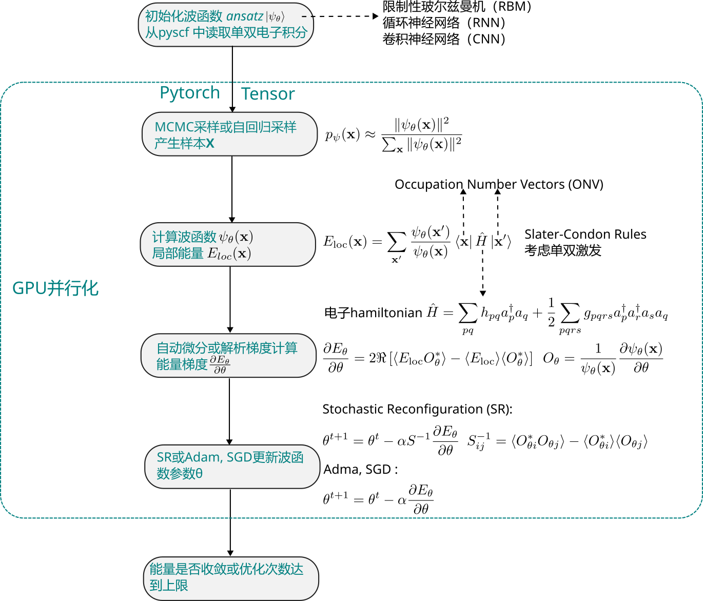
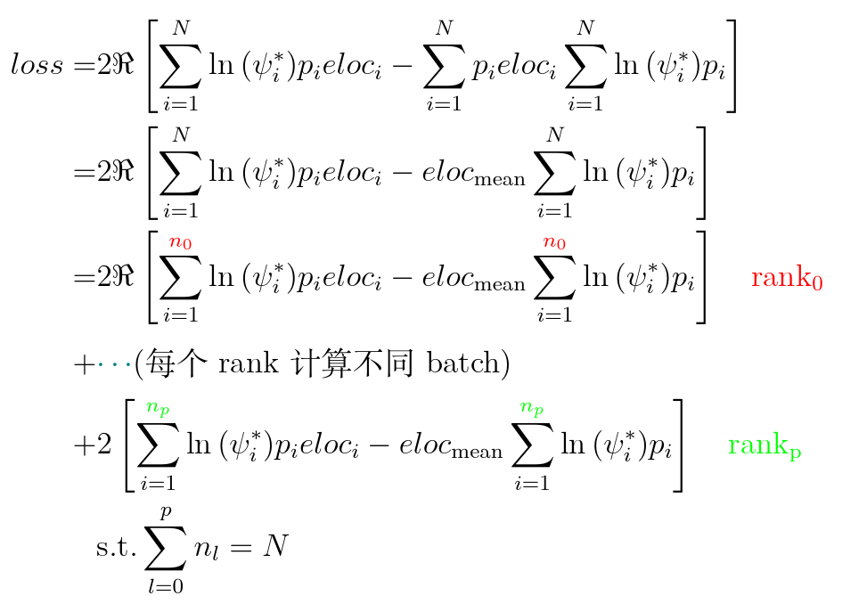

# torch_Full_CI
A simple function calculates &lt;n|H|m> using the Pytorch tensor in CPU or GPU.


**Approximate process**



**Eloc Distributed  process**




## Installation

#### Compile CPP sources
```bash
> cd cpp_src
> sh compile.sh -h
# Use shell script to Compile CPU or GPU code with conditional compilation.
#         sh compile.sh -s CPU or -s GPU
> sh compile.sh -s GPU 
> ls  # you can find the 'setup.py', Check compilers CC and CXX
# cpu cuda common tensor compile.sh setup.py
# set magma_DIR and torch_DIR in 'setup.py'
> python setup.py develop # begin compile
# ....
> mv C_extension.so ../libs/   # move 'C_extension.so' to '../libs' 
```

#### run example

```bash
> ls # check main directory
# ci  cpp_src  docs  libs  main.py  README.md  test  utils  vmc
> mv test/example_H4.py ../
> vi run.sh  # set export RUN_FILE="example_H4.py"
> ./run.sh  # You can find the *.png, *.pth and *.npz file in ./tmp/  
```

